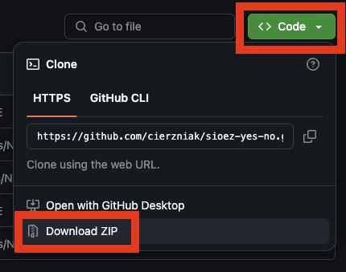
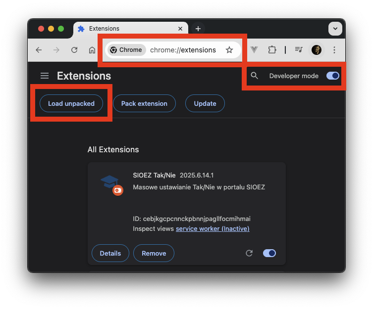
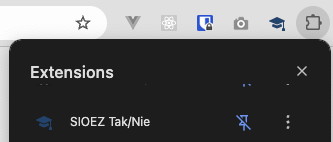
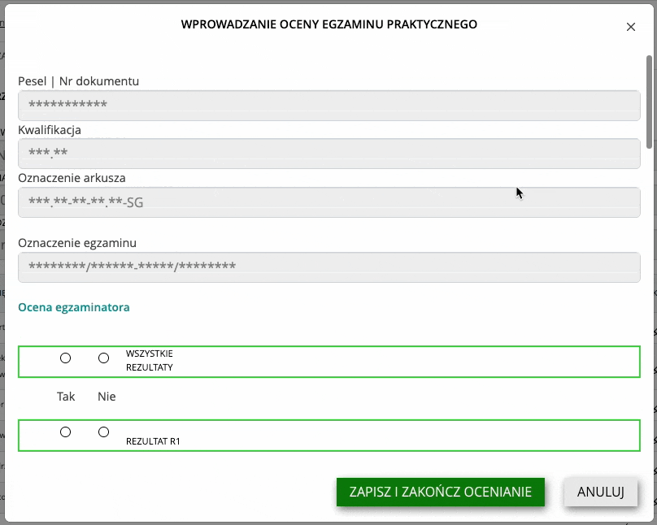

# SIOEZ Tak/Nie - wtyczka do Chromium

Wtyczka do przeglądarek opartych o Chromium (Chrome, Edge, Brave) do automatycznego klikania Tak/Nie na stronie SIOEZ.

Testowane na SIOEZ w wersji `3.131.5`.

## Sposób instalacji

1. Pobierz repozytorium i rozpakuj w dowolnym miejscu

_na przykładzie Google Chrome_

1. Wejdź w [chrome://extensions/](chrome://extensions/)
2. Włącz Tryb deweloperski
3. Kliknij „Wczytaj rozpakowany” i wybierz katalog, w którym znajduje się rozpakowane repozytorium z wtyczką

## Sposób użycia

Po instalacji wtyczki pojawia się nowy przycisk na pasku (może być schowany w menu wspólnym, wtedy można go przypiąć)
z ikoną SIOEZ. Naciśnięcie przycisku przekierowuje na stronę SIOEZ.

Wejście na widok wpisywania wyników automatycznie aktywuje wtyczkę.

